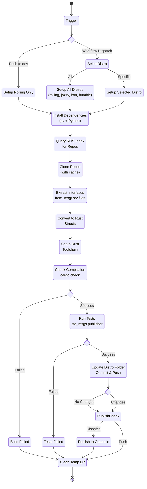

# ROS2 interfaces generated for rust lang

This repository contains Rust structs for all interfaces (i.e., messages and services) that are listed as releases on the ROS Index for various distributions listed [below](#links).

## How ? 

We fetch the [ROS Index](https://index.ros.org/?search_packages=true) to get per distro official packages. We then gather all of them and translate all of them to `rust` interfaces using [ros2_client](https://github.com/Atostek/ros2-client). We commit our changes to the distro folder and then update the crates you can find on [crates.io](https://crates.io)

## Links

| Distribution | Messages | Crates.io |
|---|---|---|
| Rolling | [list of msg](./ros2-interfaces-rolling/) | [ros2-interfaces-rolling](https://crates.io/crates/ros2-interfaces-rolling) |
| Jazzy | [list of msg](./ros2-interfaces-jazzy/) | [ros2-interfaces-jazzy](https://crates.io/crates/ros2-interfaces-jazzy) |
| Iron | [list of msg](./ros2-interfaces-iron/) | [ros2-interfaces-iron](https://crates.io/crates/ros2-interfaces-iron) |
| Humble | [list of msg](./ros2-interfaces-humble/) | [ros2-interfaces-humble](https://crates.io/crates/ros2-interfaces-humble) |

## CI Pipeline

## Things to do 
Add a cron schedule to the [pipeline](./.github/workflows/pipeline.yml)